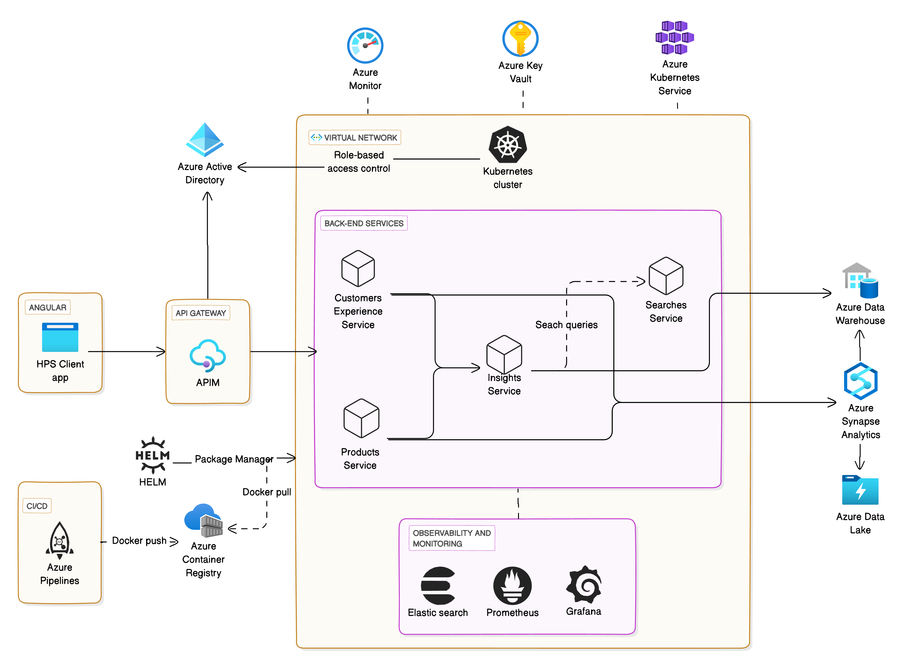

# How People Shop (HPS) Product - Technical Assignment

## Summary

The "How People Shop" (HPS) product is a web-based solution designed to collect, analyze, and share insights on customer shopping behaviors. This tool will support IKEA’s decision-making by providing valuable data on consumer interactions, enhancing the customer experience, and driving strategic decisions.
decision-making.

## Background

Understanding customer shopping behaviors is crucial for improving IKEA’s customer experience and guiding data-driven decisions. The HPS product will gather and analyze data on shopping interactions with IKEA products and services to support an enhanced omnichannel experience.


## Design

The HPS product features a web-based architecture supported by microservices for retrieving analytics and insights generation. The design includes:

- **Architecture Diagram**
- **Component Communications**
- **Unified Data Model**
- **Data Integrations**

## Definition of Success

Success will be measured by the following criteria:

- Accurate data collection and storage of customer shopping data
- Efficient processing and real-time insights generation
- Secure and scalable architecture
- Positive feedback from decision-makers within IKEA on the usability and insights provided by the product.

## Goals

- Store and catalogue existing knowledge about customer shopping experiences.
- Make the data easily searchable and accessible from within the HPS web-based product.
- Drive consumer-centric decision-making by providing insights into customer needs and behaviors.
- Strengthen the IKEA concept and ensure business growth.

## Table of Contents

1. [Architecture Diagrams](#architecture-diagrams)
    - [High-level Architecture](#high-level-architecture)
    - [Frontend Architecture](#frontend-architecture)
    - [Components Detail](#components-detail)
    - [Components Communication Flow](#components-communication-flow)
    - [Unified Data Model](#unified-data-model)
2. [Project Demo](#project-demo)
3. [Technologies Used](#technologies-used)
    - [Core Microservices](#core-microservices)
    - [Data Processing and Storage](#data-processing-and-storage)
    - [Observability and Data Quality](#observability-and-data-quality)
    - [Security and Authentication](#security-and-authentication)
4. [Data Flow and Integration](#data-flow-and-integration)
    - [Data Processing](#data-processing)
    - [ETL Process](#etl-process)
    - [Handling Structured and Unstructured Data](#handling-structured-and-unstructured-data)
    - [Scalability](#scalability)
    - [Trigger Mechanisms](#trigger-mechanisms)
5.  [Challenges/Concerns and Resolutions](#challengesconcerns-and-resolutions)
6.  [Coffee Consumption Calculation](#coffee-consumption-calculation)
7.  [Time Estimates for Technical Assignments](#time-estimates-for-technical-assignments)


## **Architecture Diagrams**
#### High-level Architecture

#### Frontend Architecture


#### Components Detail

#### Components Communication Flow


#### Unified Data Model


#### Descriptions:

The HPS Data Model captures the various entities and their relationships involved in understanding customer shopping experiences. The key tables and their relationships are as follows:


| **Entity**                | **Description**                                                                                   |
|---------------------------|---------------------------------------------------------------------------------------------------|
| **Customers**             | Stores information about customers, including their name, email, and phone.                        |
| **Needs**                 | Captures different types of customer needs such as Replacement, Upgrade, or Remodel.               |
| **Product Clusters**      | Represents various product clusters like Quick Pickers, Storage Solvers, and Lasting Comfort.       |
| **Triggers**              | Includes different types of triggers that can influence shopping behavior.                         |
| **Missions**              | Defines the customer's mission types, like Solution Seeking or Recreational Shopping.              |
| **Touchpoints**           | Captures various touchpoints where customers interact with the brand.                              |
| **Journey Phases**        | Represents different phases of the customer journey.                                               |
| **Places of Purchase**    | Captures the place of purchase, either Store or Online.                                             |
| **Customer Experiences**  | Links customer interactions with various aspects of their shopping journey.                         |
| **Customer Experience Insights**      | Stores insights related to customer experiences.       
| **Product Insights**      | Stores insights related to product clusters and their triggers.                                     |
#### Sample Queries:
| Query Description                          | SQL Query                                                                                               |
|--------------------------------------------|---------------------------------------------------------------------------------------------------------|
| Retrieve Product Insights                   | ```SELECT pi.id AS insight_id,pc.name AS product_cluster,t.type AS trigger_type,pi.insight FROM product_insights pi JOIN product_clusters pc ON pi.product_cluster_id = pc.id JOIN triggers t ON pi.trigger_id = t.id;``` |
| Retrieve Customer Experiences              | ```SELECT ce.id AS experience_id, c.name AS customer_name, n.type AS need_type, m.type AS mission_type, tp.type AS touchpoint_type, jp.phase AS journey_phase, pp.type AS place_of_purchase FROM customer_experiences ce JOIN customers c ON ce.customer_id = c.id JOIN needs n ON ce.need_id = n.id JOIN missions m ON ce.mission_id = m.id JOIN touchpoints tp ON ce.touchpoint_id = tp.id JOIN journey_phases jp ON ce.journey_phase_id = jp.id JOIN places_of_purchase pp ON ce.place_of_purchase_id = pp.id;``` |
| Retrieve Customer Experience Insights      | ```SELECT cei.id AS insight_id, ce.id AS experience_id, cei.title AS title, cei.description AS description FROM customer_experience_insights cei JOIN customer_experiences ce ON cei.customer_experience_id = ce.id GROUP BY cei.id, ce.id, cei.title, cei.description;``` |

<!--  -->

##  **Project Demo**

### Service:  Customers Experience Insight

### Prerequisites:

- Java JDK 17+
- Docker
- Maven

### Steps


1. Clone the repository:
    ```bash
    git clone https://github.com/r0jjames/IKEA-How-People-Shop-Project.git
    cd customers-experience
    ```
2. Run DB in the Docker container:
    ```bash
    cd docker-compose
    docker compose up
    ```
3. Build the project:
    ```bash
    ./mvnw clean install
    ```

4. Run the application:
    ```bash
    ./mvnw spring-boot:run
    ```
5. The application uses OpenAPI for API documentation and Testing of APIs. Once the application is running, you can access the documentation UI at: http://localhost:8080/swagger-ui.html

### API Endpoints:

### Product Insights

Retrieve insights on how people shop for different product clusters.

- **URL:** `/api/products/insights`
- **Method:** `GET`
- **Description:** Fetches all product insights.

#### Sample Response:

```json
[
    {
        "id": 1,
        "productClusterId": 1,
        "triggerId": 1,
        "insight": "Quick Pickers are highly influenced by price reductions during sales events."
    },
    {
        "id": 2,
        "productClusterId": 2,
        "triggerId": 2,
        "insight": "Storage Solvers see an increase in demand during the back-to-school season."
    }
    
]
```
### Customer Insights
Retrieve insights on customer experiences.
- **URL:** `/api/customers/insights`
- **Method:** `GET`
- **Description:** Fetches all customer experience insights.

#### Sample Response:

```json
[
    {
        "customerExperienceId": 1,
        "title": "Seamless Browsing Experience",
        "description": "Customer found the online browsing experience seamless and intuitive."
    },
    {
        "customerExperienceId": 2,
        "title": "Overwhelmed by Options",
        "description": "Customer felt overwhelmed by too many options at the store."
    },
    {
        "customerExperienceId": 3,
        "title": "Easy Product Comparison",
        "description": "Comparing products on the brand website was easy and helpful."
    }
    
]
```

### Customer Experiences
Retrieve details on customer experiences.
- **URL:** `/api/customers/experiences`
- **Method:** `GET`
- **Description:** Fetches all customer experiences.

#### Sample Response:

```json
[
  {
    "id": 1,
    "customerId": 1,
    "customerName": "Alice Johnson",
    "needType": "Replacement",
    "missionType": "Solution Seeking",
    "touchpointType": "Brand Website",
    "journeyPhase": "Browsing",
    "placeOfPurchase": "Store"
  },
  {
    "id": 2,
    "customerId": 2,
    "customerName": "Bob Brown",
    "needType": "Upgrade",
    "missionType": "Recreational Shopping",
    "touchpointType": "Store",
    "journeyPhase": "Filtering",
    "placeOfPurchase": "Online"
  },
    
]
```

## **Technologies Used**

### **Core Microservices**

| **Aspect**                    | **Technologies**                                                                                                                                                     | **Description**                                                 |
|-------------------------------|--------------------------------------------------------------------------------------------------------------------------------------------------------------------------|---------------------------------------------------------------------|
| **Customers Experience Service** | Java, Spring Boot, Azure Kubernetes Service (AKS), Azure Container Registry, Azure Active Directory (AAD)                                                            | Manages customer profiles, preferences, and shopping behavior data. |
| **Products Service**            | Java, Spring Boot, Azure Kubernetes Service (AKS), Azure Container Registry, Azure Active Directory (AAD)                                                            | Provides product-related data for analysis and recommendations.    |
| **Insights Service**            | Java, Spring Boot, Azure Kubernetes Service (AKS), Azure Container Registry, Azure Active Directory (AAD)                                                            | Analyzes data to provide insights into customer behavior, needs, and trends. |
| **Searches Service**            | Java, Spring Boot, Azure Kubernetes Service (AKS), Azure Container Registry, Azure Active Directory (AAD)                                                            | Handles search operations and indexing to enable aggregated insights and trend searches. |

### **Data Processing and Storage**

| **Aspect**            | **Technologies**                                                | **Description**                                                     |
|-----------------------|-------------------------------------------------------------------|-------------------------------------------------------------------------|
| **Data Ingestion**    | Azure Data Factory (for batch), Azure Event Hubs (for high-throughput real-time), Azure IoT Hub (for IoT data)                      | Ingests data from various sources including databases, APIs, files. It handles high-throughput and real-time data streaming. |
| **Data Transformation** | Azure Databricks                                               | Transforms and processes data, including large-scale data cleaning and enrichment. |
| **Data Storage**      | Azure Synapse Analytics, Azure Data Lake, Azure Data Warehouse, Elasticsearch | Stores structured and unstructured data; indexes for faster retrieval and analysis data. |

### **Observability and Data Quality**

| **Aspect**          | **Technologies**                  | **Description**                                         |
|---------------------|-----------------------------------|------------------------------------------------------------|
| **Monitoring**      | Prometheus, Grafana, Azure Monitor               | Real-time monitoring, alerting, and visualization for microservices, data pipelines, and infrastructure. |
| **Observability**   | Azure Monitor, Azure Application Insights | Comprehensive monitoring, diagnostics, alerts, and performance management for applications and infrastructure. |
| **Data Quality**    | Azure Data Catalog, Azure Purview | Ensures data integrity and governance. Azure Data Catalog for metadata management and discovery, Azure Purview for comprehensive data governance and compliance. |
| **Data Lineage**    | Azure Purview | Tracks the flow and transformations of data across the pipeline to understand data lineage and dependencies. |
| **Logging**         | Azure Monitor Logs, ELK Stack      | Captures logs from data processing and ingestion to aid in troubleshooting and performance optimization. |

### **Security and Authentication**

| **Aspect**           | **Technologies**                 | **Description**                                     |
|----------------------|----------------------------------|--------------------------------------------------------|
| **Authentication**   | Azure Active Directory (AAD)     | Authenticates users and applications, ensuring secure access. |
| **Authorization**    | Azure Active Directory (AAD)     | Implements role-based access control (RBAC) to manage permissions. |
| **Secret Management**| Azure Key Vault                   | Stores and manages secrets securely to protect sensitive information. |
| **Data Encryption**  | Azure Key Vault, Azure Storage Encryption | Azure Key Vault manages encryption keys, while Azure Storage Encryption encrypts data at rest and in transit for services including Azure Data Lake and Azure Synapse Analytics.. |
| **Data Masking**     | Azure Synapse Analytics, Azure Data Factorye | Applies data masking to obscure sensitive information from unauthorized users, providing dynamic data masking capabilities.  |
| **Access Control**   | Azure Active Directory (AAD), Azure Managed Identities | Azure AAD handles user and application authentication and RBAC. Managed Identities provide secure, automated authentication for Azure resources.. |

### **Data Flow and Integration**

**Lifecycle of Data Management**

| **Step**              | **Description**                                                                                             |
|-----------------------|-------------------------------------------------------------------------------------------------------------|
| **Data Ingestion**    | Use Azure Data Factory for batch data ingestion from various sources and Azure Stream Analytics for real-time data streaming. |
| **Data Transformation** | Utilize Azure Databricks for data transformation and processing.                                           |
| **Data Storage**      | 	Store data in Azure Synapse Analytics (structured) and Azure Data Lake (unstructured).          |
| **Data Processing**   | Leverage Azure Synapse Analytics and Azure Databricks for ETL and data processing.                |

### **Handling Structured and Unstructured Data**

| **Aspect**                  | **Technologies**                     | **Description**                                  |
|-----------------------------|--------------------------------------|-----------------------------------------------------|
| **Data Storage**            | Azure Data Lake, Azure Synapse Analytics, Azure SQL Database | Azure Data Lake for unstructured data, Azure Synapse Analytics for structured and semi-structured data, Azure SQL Database for transactional and operational needs.           |
| **Data Processing**         | Azure Databricks                     | Processes and analyzes large volumes of data.      |
| **Indexing and Search**     | Elasticsearch Service                | Unstructured Data: Provides full-text search, advanced querying, and indexing capabilities. Integrates with web applications for efficient search and retrieval. |

### **Scalability**

**Scalability of Data Processing and Ingestion**

| **Aspect**                  | **Technologies**                           | **Description**                                      |
|-----------------------------|--------------------------------------------|---------------------------------------------------------|
| **Data Ingestion Scalability** | Azure Data Factory, Azure Stream Analytics | Scales batch and real-time data ingestion. Azure Data Factory handles batch processes, while Stream Analytics manages real-time data streams. |
| **Data Processing Scalability** | Azure Databricks                        | Provides distributed processing with dynamic cluster scaling for large-scale data handling. |
| **Data Storage Scalability**   | Azure Synapse Analytics, Azure Data Lake | Provides distributed processing with dynamic cluster scaling for large-scale data handling. |

**General Scalability**

| **Aspect**             | **Technologies**                           | **Description**                                      |
|------------------------|--------------------------------------------|---------------------------------------------------------|
| **Horizontal Scaling** | Azure Kubernetes Service (AKS)             | Scales microservices horizontally based on demand. Integrates with Azure Autoscale for dynamic scaling.      |
| **Load Balancing**     | Azure Load Balancer                        | Distributes traffic across multiple instances to ensure high availability and reliability.          |
| **Distributed Processing** | Azure Databricks                        | Enables distributed data processing with Apache Spark for large-scale analytics.       |

### **Trigger Mechanisms**

| **Trigger Mechanism**                   | **Technologies**                     | **Description**                                   |
|------------------------------|--------------------------------------|------------------------------------------------------|
| **Event-Driven** | Azure Functions, Azure Event Grid   | Azure Functions: Executes code in response to events; suitable for serverless, event-based processing. Azure Event Grid: Routes events from various sources and integrates with other services for event-driven workflows.  eg. Azure Function can be used as a bridge between Event Grid and Data Factory. It can listen for events from Event Grid and then trigger a Data Factory pipeline. |
| **Webhook Integration**       | Webhooks                             | 	When a specific event occurs, the source system sends an HTTP request (usually a POST) to a pre-configured URL, which can be an endpoint in another system. This enables real-time communication and integration between different systems. |
| **Scheduled**        | Azure Logic Apps, Azure Automation   | Azure Logic Apps: Automates workflows with scheduled triggers; supports complex integrations and recurring tasks. Azure Automation: Manages and automates scheduled jobs and workflows using runbooks in PowerShell, Python, or graphical interfaces. |
| **Streaming Data**   | Azure Stream Analytics               | Processes real-time data streams and triggers actions based on data patterns or events; integrates with various data sources for real-time analytics. Example: Writes processed data to Azure Blob Storage, which can then trigger an Azure Data Factory pipeline for further processing and ingestion. |
#### Note:
Azure Data Factory can be triggered or initiate pipelines for data extraction and ingestion in conjunction with the technologies listed above. For instance:

- **Event-Driven Triggers:** Azure Data Factory can use event-based triggers to start pipelines in response to events detected by Azure Functions or Azure Event Grid.
- **Webhook Integration:** Azure Data Factory pipelines can be initiated via webhooks, enabling real-time data integration.
- **Scheduled Triggers:** Azure Data Factory supports time-based triggers to run data pipelines on a schedule.
- **Streaming Data Triggers:** Azure Data Factory can process outputs from Azure Stream Analytics to further transform and ingest data.

### Challenges/Concerns and Resolutions

| **Concern**                      | **Resolution**                                                                                                  |
|----------------------------------|-----------------------------------------------------------------------------------------------------------------|
| **API Gateway Performance and Reliability** | - **Load Balancing:** Implement [Azure Front Door](https://docs.microsoft.com/en-us/azure/frontdoor/) or [Azure Application Gateway](https://docs.microsoft.com/en-us/azure/application-gateway/) for global and regional traffic management. <br> - **Auto-Scaling:** Configure auto-scaling in [Azure API Management (APIM)](https://docs.microsoft.com/en-us/azure/api-management/api-management-scaling) to handle varying loads. <br> - **Performance Testing:** Perform regular performance testing and monitor API metrics to detect and address potential bottlenecks. |
| **Security and Access Control**   | - **Role-Based Access Control (RBAC):** Use [Azure Active Directory (AAD)](https://docs.microsoft.com/en-us/azure/active-directory/) to manage access. <br> - **Access Audits:** Regularly audit access logs and permissions. <br> - **Secrets Management:** Secure secrets and keys with [Azure Key Vault](https://docs.microsoft.com/en-us/azure/key-vault/). <br> - **Encryption and Data Masking:** Apply encryption and data masking for sensitive data. <br> - **Security Management:** Implement [Azure Security Center](https://docs.microsoft.com/en-us/azure/security-center/) for comprehensive security management. |
| **Scalability of Back-End Services** | - **Horizontal Scaling:** Use [Azure Kubernetes Service (AKS)](https://docs.microsoft.com/en-us/azure/aks/) and configure auto-scaling policies. <br> - **Resource Monitoring:** Monitor resource utilization with [Azure Monitor](https://docs.microsoft.com/en-us/azure/azure-monitor/) and [Prometheus](https://prometheus.io/). <br> - **Data Storage:** Ensure [Azure Synapse Analytics](https://docs.microsoft.com/en-us/azure/synapse-analytics/) and [Azure Data Lake](https://docs.microsoft.com/en-us/azure/storage/blobs/data-lake-storage-introduction) are optimized for large data volumes and configured for auto-scaling. |
| **Observability and Monitoring**  | - **Monitoring and Visualization:** Combine [Azure Monitor](https://docs.microsoft.com/en-us/azure/azure-monitor/) with [Prometheus](https://prometheus.io/) and [Grafana](https://grafana.com/) for comprehensive observability. <br> - **Alerts and Dashboards:** Set up alerts and dashboards for real-time insights. <br> - **Log Indexing:** Integrate [Elastic Search](https://www.elastic.co/what-is/elasticsearch) for log indexing and search capabilities. <br> - **Data Governance:** Use [Microsoft Purview](https://docs.microsoft.com/en-us/azure/purview/) for data cataloging, governance, and quality management. |
| **Data Consistency and Integrity** | - **Data Synchronization:** Implement data synchronization tools to maintain consistency. <br> - **Consistency Checks:** Use [Azure Synapse Analytics](https://docs.microsoft.com/en-us/azure/synapse-analytics/) and [Azure Data Factory](https://docs.microsoft.com/en-us/azure/data-factory/) for data consistency checks. <br> - **Audits and Backups:** Conduct regular data integrity audits and backups. <br> - **Data Quality Management:** Manage data quality and lineage with [Microsoft Purview](https://docs.microsoft.com/en-us/azure/purview/). |
| **Deployment and CI/CD**          | - **CI/CD Automation:** Use [Azure Pipelines](https://docs.microsoft.com/en-us/azure/devops/pipelines/?view=azure-devops) for CI/CD and [Helm](https://helm.sh/) for Kubernetes deployments. <br> - **Rollback Mechanisms:** Implement rollback mechanisms and continuous testing for reliability. <br> - **Pipeline Optimization:** Optimize pipeline configurations for efficient builds and deployments. <br> - **Deployment Strategies:** Consider [Blue/Green](https://docs.microsoft.com/en-us/azure/architecture/intro-to-cloud-computing/deployment-strategies) or [Canary](https://docs.microsoft.com/en-us/azure/architecture/intro-to-cloud-computing/deployment-strategies) deployments for safer updates. |
| **Autoscaling Complexity**       | - **Autoscaling Configuration:** Configure [Kubernetes Horizontal Pod Autoscaler (HPA)](https://kubernetes.io/docs/tasks/run-application/horizontal-pod-autoscale/) and [Cluster Autoscaler](https://kubernetes.io/docs/tasks/administer-cluster/cluster-autoscaler/) in Azure AKS. <br> - **Scaling Insights:** Use [Azure Monitor](https://docs.microsoft.com/en-us/azure/azure-monitor/) and [Prometheus](https://prometheus.io/) for insights into scaling efficiency and performance. <br> - **Review Policies:** Regularly review autoscaling rules and resource allocation to avoid scaling issues and ensure optimal performance. |
| **Inter-Service Communication**   | - **Service Mesh:** Use a service mesh like [Istio](https://istio.io/) for advanced traffic management and observability. <br> - **Message Brokers:** Implement message brokers like [Azure Service Bus](https://docs.microsoft.com/en-us/azure/service-bus-messaging/) or [Azure Event Hubs](https://docs.microsoft.com/en-us/azure/event-hubs/) for messaging and event streaming. <br> - **Service Contracts:** Ensure service contracts and APIs are well-defined and versioned. |
| **Handling Various Trigger Mechanisms** | - **Event-Driven Architecture:** Implement event-driven architecture with [Azure Functions](https://docs.microsoft.com/en-us/azure/azure-functions/) and [Azure Event Grid](https://docs.microsoft.com/en-us/azure/event-grid/). <br> - **Scheduled Tasks:** Use [Azure Logic Apps](https://docs.microsoft.com/en-us/azure/logic-apps/) and [Azure Automation](https://docs.microsoft.com/en-us/azure/automation/) for scheduled and recurring tasks. <br> - **Real-Time Processing:** Leverage [Azure Stream Analytics](https://docs.microsoft.com/en-us/azure/stream-analytics/) for real-time data streaming and processing. <br> - **Error Handling:** Ensure robust error handling and retry mechanisms for trigger-based workflows. |
| **Data Ingestion and Processing Performance** | - **Pipeline Optimization:** Optimize data ingestion pipelines with [Azure Data Factory](https://docs.microsoft.com/en-us/azure/data-factory/) and [Azure Stream Analytics](https://docs.microsoft.com/en-us/azure/stream-analytics/). <br> - **Data Transformation:** Use [Azure Databricks](https://docs.microsoft.com/en-us/azure/databricks/) for efficient data transformation and processing. <br> - **Performance Monitoring:** Regularly monitor pipeline performance and data processing metrics. <br> - **Data Partitioning:** Implement data partitioning and parallel processing where applicable. |

## Coffee Consumption Calculation

For simplicity, let's assume the following composition for the HPS product team:

- 1 Product Owner
- 1 Scrum Master
- 8 Development Team members

We will assume the average coffee consumption and working days per sprint for each role. Here’s the breakdown:

**Number of working days per sprint**: 10 (2-week sprint)

| Role               | Number of People | Average Cups of Coffee per Day | Total Cups of Coffee per Sprint                  |
|--------------------|------------------|-------------------------------|--------------------------------------------------|
| Product Owner      | 1                | 2                             | 1 × 2 cups/day × 10 days = 20 cups               |
| Scrum Master       | 1                | 2                             | 1 × 2 cups/day × 10 days = 20 cups               |
| Development Team   | 8                | 3                             | 8 × 3 cups/day × 10 days = 240 cups              |
| **Total**          | **10**           | -                             | **20 + 20 + 240 = 280 cups**                     |


**Conclusion**: The HPS product team consumes a total of 280 cups of coffee each sprint. <br>
***But wait... the team also needs some champagne! 🍾🎉 For celebrating team collaboration and successful deliveries!***

## Time Estimates for Technical Assignments

| Assignment Task                                 | Time Estimate   |
|-------------------------------------------------|-----------------|
| Solo brainstorming with my pen and notebook     | 1-2 hours       |
| Sketching Architecture Diagrams                 | 4-5 hours       |
| Creating customer experience Restful APIs       | 2-3 hours       |
| HPS Unified Data Model + SQL Queries            | 1-2 hours       |
| Technical Specification                         | 1-2 hours       |
| Challenges/Concerns + Calculation of cups of coffee | 1-2 hours    |
| Thinking & Apply improvements                   | 1-2 hours       |
| Document everything in README.md file           | 1-2 hours       |

**Total Estimated Time:** 12-20 hours


# Contact
For any inquiries or issues, please email: rojjamescarranza@gmail.com.