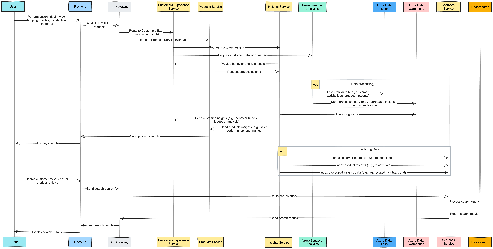

# How People Shop (HPS) Product - Technical Assignment

## Summary

The "How People Shop" (HPS) product is a web-based solution designed to collect, analyze, and share insights on customer shopping behaviors. This tool will support IKEA’s decision-making by providing valuable data on consumer interactions, enhancing the customer experience, and driving strategic decisions.
decision-making.

## Background

Understanding customer shopping behaviors is crucial for improving IKEA’s customer experience and guiding data-driven decisions. The HPS product will gather and analyze data on shopping interactions with IKEA products and services to support an enhanced omnichannel experience.


## Design

The HPS product features a web-based architecture supported by microservices for retrieving analytics and insights generation. The design includes:

- **Architecture Diagram**
- **Component Communications**
- **Unified Data Model**
- **Data Integrations**

## Definition of Success

Success will be measured by the following criteria:

- Accurate data collection and storage of customer shopping data
- Efficient processing and real-time insights generation
- Secure and scalable architecture
- Positive feedback from decision-makers within IKEA on the usability and insights provided by the product.

## Goals

- Store and catalogue existing knowledge about customer shopping experiences.
- Make the data easily searchable and accessible from within the HPS web-based product.
- Drive consumer-centric decision-making by providing insights into customer needs and behaviors.
- Strengthen the IKEA concept and ensure business growth.

## Table of Contents

1. [Architecture Diagram](#architecture-diagram)
2. [Components Communication Flow](#sequence-diagram)
3. [Unified Data Model](#unified-data-model)
4. [Technologies and Tools Integration](#technologies-and-tools-integration)
    - [Core Microservices](#core-microservices)
    - [Data Processing and Storage](#data-processing-and-storage)
    - [Observability and Data Quality](#observability-and-data-quality)
    - [Security and Authentication](#security-and-authentication)
5. [Data Flow and Integration](#data-flow-and-integration)
6. [Data Processing](#data-processing)
    - [ETL Process](#etl-process)
    - [Handling Structured and Unstructured Data](#handling-structured-and-unstructured-data)
    - [Scalability](#scalability)
    - [Trigger Mechanisms](#trigger-mechanisms)
7.  [Challenges/Concerns and Resolutions](#challengesconcerns-and-resolutions)
8.  [Coffee Consumption Calculation](#coffee-consumption-calculation)
9.  [Time Estimates for Technical Assignments](#Time-Estimates-for-Technical-Assignments)
10. [How to Run the Project](#how-to-run-the-project)
11. [Contact](#contact)

## Architecture Diagram
#### End-to-End:

#### Frontend:


#### Components:

#### Backend Communication Flow:


## Unified Data Model


#### Descriptions:

The HPS Data Model captures the various entities and their relationships involved in understanding customer shopping experiences. The key tables and their relationships are as follows:


| **Entity**                | **Description**                                                                                   |
|---------------------------|---------------------------------------------------------------------------------------------------|
| **Customers**             | Stores information about customers, including their name, email, and phone.                        |
| **Needs**                 | Captures different types of customer needs such as Replacement, Upgrade, or Remodel.               |
| **Product Clusters**      | Represents various product clusters like Quick Pickers, Storage Solvers, and Lasting Comfort.       |
| **Triggers**              | Includes different types of triggers that can influence shopping behavior.                         |
| **Missions**              | Defines the customer's mission types, like Solution Seeking or Recreational Shopping.              |
| **Touchpoints**           | Captures various touchpoints where customers interact with the brand.                              |
| **Journey Phases**        | Represents different phases of the customer journey.                                               |
| **Places of Purchase**    | Captures the place of purchase, either Store or Online.                                             |
| **Customer Experiences**  | Links customer interactions with various aspects of their shopping journey.                         |
| **Customer Experience Insights**      | Stores insights related to customer experiences.       
| **Product Insights**      | Stores insights related to product clusters and their triggers.                                     |
#### Sample Queries:
| Query Description                          | SQL Query                                                                                               |
|--------------------------------------------|---------------------------------------------------------------------------------------------------------|
| Retrieve Product Insights                   | ```SELECT pi.id AS insight_id,pc.name AS product_cluster,t.type AS trigger_type,pi.insight FROM product_insights pi JOIN product_clusters pc ON pi.product_cluster_id = pc.id JOIN triggers t ON pi.trigger_id = t.id;``` |
| Retrieve Customer Experiences              | ```SELECT ce.id AS experience_id, c.name AS customer_name, n.type AS need_type, m.type AS mission_type, tp.type AS touchpoint_type, jp.phase AS journey_phase, pp.type AS place_of_purchase FROM customer_experiences ce JOIN customers c ON ce.customer_id = c.id JOIN needs n ON ce.need_id = n.id JOIN missions m ON ce.mission_id = m.id JOIN touchpoints tp ON ce.touchpoint_id = tp.id JOIN journey_phases jp ON ce.journey_phase_id = jp.id JOIN places_of_purchase pp ON ce.place_of_purchase_id = pp.id;``` |
| Retrieve Customer Experience Insights      | ```SELECT cei.id AS insight_id, ce.id AS experience_id, cei.title AS title, cei.description AS description FROM customer_experience_insights cei JOIN customer_experiences ce ON cei.customer_experience_id = ce.id GROUP BY cei.id, ce.id, cei.title, cei.description;``` |

<!--  -->
## **Technologies Used**

### **Core Microservices**

| **Aspect**                    | **Technologies**                                                                                                                                                     | **Specifications**                                                 |
|-------------------------------|--------------------------------------------------------------------------------------------------------------------------------------------------------------------------|---------------------------------------------------------------------|
| **Customers Experience Service** | Java, Spring Boot, Azure Kubernetes Service (AKS), Azure Container Registry, Azure Active Directory (AAD)                                                            | Manages customer profiles, preferences, and shopping behavior data. |
| **Products Service**            | Java, Spring Boot, Azure Kubernetes Service (AKS), Azure Container Registry, Azure Active Directory (AAD)                                                            | Provides product-related data for analysis and recommendations.    |
| **Insights Service**            | Java, Spring Boot, Azure Kubernetes Service (AKS), Azure Container Registry, Azure Active Directory (AAD)                                                            | Analyzes data to provide insights into customer behavior, needs, and trends. |
| **Searches Service**            | Java, Spring Boot, Azure Kubernetes Service (AKS), Azure Container Registry, Azure Active Directory (AAD)                                                            | Handles search operations and indexing to enable aggregated insights and trend searches. |

### **Data Processing and Storage**

| **Aspect**            | **Technologies**                                                | **Specifications**                                                     |
|-----------------------|-------------------------------------------------------------------|-------------------------------------------------------------------------|
| **Data Ingestion**    | Azure Data Factory (for batch), Azure Event Hubs (for high-throughput real-time), Azure IoT Hub (for IoT data)                      | Ingests data from various sources including databases, APIs, files. It handles high-throughput and real-time data streaming. |
| **Data Transformation** | Azure Databricks                                               | Transforms and processes data, including large-scale data cleaning and enrichment. |
| **Data Storage**      | Azure Synapse Analytics, Azure Data Lake, Azure Data Warehouse, Elasticsearch | Stores structured and unstructured data; indexes for faster retrieval and analysis data. |

### **Observability and Data Quality**

| **Aspect**          | **Technologies**                  | **Specifications**                                         |
|---------------------|-----------------------------------|------------------------------------------------------------|
| **Monitoring**      | Prometheus, Grafana, Azure Monitor               | Real-time monitoring, alerting, and visualization for microservices, data pipelines, and infrastructure. |
| **Observability**   | Azure Monitor, Azure Application Insights | Comprehensive monitoring, diagnostics, alerts, and performance management for applications and infrastructure. |
| **Data Quality**    | Azure Data Catalog, Azure Purview | Maintains data quality and governance; ensures data integrity and compliance. |
| **Data Lineage**    | Azure Data Catalog, Azure Purview | Tracks the flow and transformations of data across the pipeline to understand data lineage and dependencies. |
| **Logging**         | Azure Monitor Logs, ELK Stack      | Captures logs from data processing and ingestion to aid in troubleshooting and performance optimization. |

### **Security and Authentication**

| **Aspect**           | **Technologies**                 | **Specifications**                                     |
|----------------------|----------------------------------|--------------------------------------------------------|
| **Authentication**   | Azure Active Directory (AAD)     | Authenticates users and applications, ensuring secure access. |
| **Authorization**    | Azure Active Directory (AAD)     | Implements role-based access control (RBAC) to manage permissions. |
| **Secret Management**| Azure Key Vault                   | Stores and manages secrets securely to protect sensitive information. |
| **Data Encryption**  | Azure Key Vault, Azure Storage Encryption | Encrypts data at rest and in transit to safeguard against unauthorized access. |
| **Data Masking**     | Azure Data Factory, Azure SQL Database | Applies data masking to obscure sensitive information from unauthorized users. |
| **Access Control**   | Azure Active Directory (AAD), Azure Managed Identities | Controls access to data based on user roles and service identities. |

### **Data Flow and Integration**

**Lifecycle of Data Management**

| **Step**              | **Description**                                                                                             |
|-----------------------|-------------------------------------------------------------------------------------------------------------|
| **Data Ingestion**    | Use Azure Data Factory for batch data ingestion from various sources and Azure Stream Analytics for real-time data streaming. |
| **Data Transformation** | Utilize Azure Databricks for data transformation and processing.                                           |
| **Data Storage**      | Store data in Azure Synapse Analytics for structured data and Azure Data Lake for unstructured data.          |
| **Data Processing**   | Azure Synapse Analytics and Azure Databricks for data extraction, transformation, and loading.                |

### **Handling Structured and Unstructured Data**

| **Aspect**                  | **Technologies**                     | **Specifications**                                  |
|-----------------------------|--------------------------------------|-----------------------------------------------------|
| **Data Storage**            | Azure Data Lake, Azure Synapse Analytics, Azure SQL Database | Stores structured and unstructured data.           |
| **Data Processing**         | Azure Databricks                     | Processes and analyzes large volumes of data.      |
| **Indexing and Search**     | Elasticsearch Service                | Indexes and searches unstructured data for efficient retrieval. |

### **Scalability**

**Scalability of Data Processing and Ingestion**

| **Aspect**                  | **Technologies**                           | **Specifications**                                      |
|-----------------------------|--------------------------------------------|---------------------------------------------------------|
| **Data Ingestion Scalability** | Azure Data Factory, Azure Stream Analytics | Scales ingestion processes to handle large volumes of data, both batch and real-time. |
| **Data Processing Scalability** | Azure Databricks                        | Provides distributed data processing and analysis to handle large-scale data efficiently. |
| **Data Storage Scalability**   | Azure Synapse Analytics, Azure Data Lake | Scales data storage to accommodate growing data volumes and supports efficient querying and analysis. |

**General Scalability**

| **Aspect**             | **Technologies**                           | **Specifications**                                      |
|------------------------|--------------------------------------------|---------------------------------------------------------|
| **Horizontal Scaling** | Azure Kubernetes Service (AKS)             | Scales microservices horizontally based on demand.      |
| **Load Balancing**     | Azure Load Balancer                        | Distributes traffic across multiple instances.          |
| **Distributed Processing** | Azure Databricks                        | Enables distributed data processing and analysis.       |

### **Trigger Mechanisms**

| **Aspect**                   | **Technologies**                     | **Specifications**                                   |
|------------------------------|--------------------------------------|------------------------------------------------------|
| **Event-Driven Architecture** | Azure Functions, Azure Event Grid   | Implements serverless functions and event-driven processing to trigger data extraction and ingestion based on specific events or conditions. |
| **Webhook Integration**       | Webhooks                             | Triggers data ingestion processes and other actions based on external events or changes. |
| **Scheduled Triggers**        | Azure Logic Apps, Azure Automation   | Supports scheduled and recurring data extraction and ingestion tasks to automate workflows. |
| **Streaming Data Triggers**   | Azure Stream Analytics               | Handles real-time data streaming and triggers processing workflows based on streaming data events. |


## **Challenges/Concerns and Resolutions**

| **Concern**                                             | **Resolution**                                                                                             |
|---------------------------------------------------------|------------------------------------------------------------------------------------------------------------|
| **API Gateway Performance and Reliability**            | Implement load balancing, auto-scaling, and comprehensive monitoring. Perform regular stress testing to ensure performance under high traffic. |
| **Security and Access Control**                         | Utilize Azure Active Directory (AAD) for robust role-based access control (RBAC). Regularly audit permissions and use Azure Key Vault for managing sensitive information and secrets. Implement encryption and data masking for additional security. |
| **Scalability of Back-End Services**                    | Employ horizontal scaling using Azure Kubernetes Service (AKS) and configure auto-scaling features. Monitor resource allocation with Prometheus and Grafana. Ensure data storage solutions like Azure Synapse Analytics and Azure Data Lake can scale to handle large volumes of data. |
| **Observability and Monitoring**                        | Integrate Elastic Search for indexing, Azure Monitor, Prometheus, and Grafana for logging, monitoring, and visualization. Set up alerts for anomalies and use Azure Data Catalog for tracking data lineage and quality. |
| **Data Consistency and Integrity**                      | Implement data synchronization mechanisms and use Azure Synapse Analytics for consistency checks. Conduct regular data integrity checks, backups, and ensure data quality using Azure Data Catalog. |
| **Deployment and CI/CD**                                | Utilize Azure Pipelines for automated CI/CD processes and Helm for managing Kubernetes deployments. Implement rollback mechanisms and ensure CI/CD pipelines are optimized for handling complex deployments. |
| **Autoscaling Complexity**                              | Configure Kubernetes autoscaling policies carefully and monitor interactions between services to avoid issues. Utilize Azure Monitor and Prometheus for insights into scaling performance and efficiency. |
| **Inter-Service Communication**                         | Develop robust inter-service communication mechanisms. Consider using a service mesh like Istio for advanced traffic management, monitoring, and observability. |
| **Handling Various Trigger Mechanisms**                 | Implement event-driven architecture using Azure Functions and Azure Event Grid. Leverage Azure Logic Apps and Azure Automation for scheduled and recurring tasks. Ensure real-time data streaming with Azure Stream Analytics. |
| **Data Ingestion and Processing Performance**            | Optimize data ingestion pipelines with Azure Data Factory and Azure Stream Analytics. Ensure efficient data processing and transformation with Azure Databricks. Regularly monitor performance and adjust configurations as needed. |

## Coffee Consumption Calculation

For simplicity, let's assume the following composition for the HPS product team:

- 1 Product Owner
- 1 Scrum Master
- 8 Development Team members

We will assume the average coffee consumption and working days per sprint for each role. Here’s the breakdown:

**Number of working days per sprint**: 10 (2-week sprint)

| Role               | Number of People | Average Cups of Coffee per Day | Total Cups of Coffee per Sprint                  |
|--------------------|------------------|-------------------------------|--------------------------------------------------|
| Product Owner      | 1                | 2                             | 1 × 2 cups/day × 10 days = 20 cups               |
| Scrum Master       | 1                | 2                             | 1 × 2 cups/day × 10 days = 20 cups               |
| Development Team   | 8                | 3                             | 8 × 3 cups/day × 10 days = 240 cups              |
| **Total**          | **10**           | -                             | **20 + 20 + 240 = 280 cups**                     |


**Conclusion**: The HPS product team consumes a total of 280 cups of coffee each sprint. <br>
***But wait... the team also needs some champagne! 🍾🎉 For celebrating team collaboration and successful deliveries!***

## Time Estimates for Technical Assignments

| Assignment Task                                 | Time Estimate   |
|-------------------------------------------------|-----------------|
| Solo brainstorming with my pen and notebook     | 1-2 hours       |
| Sketching Architecture Diagrams                 | 4-5 hours       |
| Creating customer experience Restful APIs       | 2-3 hours       |
| HPS Unified Data Model + SQL Queries            | 1-2 hours       |
| Technical Specification                         | 1-2 hours       |
| Challenges/Concerns + Calculation of cups of coffee | 1-2 hours    |
| Thinking & Apply improvements                   | 1-2 hours       |
| Document everything in README.md file           | 1-2 hours       |

**Total Estimated Time:** 12-20 hours

## How to Run the Project

### Prerequisites

- Java JDK 17+
- Docker
- Maven

### Steps


## How to Run

1. Clone the repository:
    ```bash
    git clone https://github.com/r0jjames/IKEA-How-People-Shop-Project.git
    cd customers-experience
    ```
2. Run DB in the Docker container:
    ```bash
    cd docker-compose
    docker compose up
    ```
3. Build the project:
    ```bash
    ./mvnw clean install
    ```

4. Run the application:
    ```bash
    ./mvnw spring-boot:run
    ```
5. The application uses OpenAPI for API documentation and Testing of APIs. Once the application is running, you can access the documentation UI at: http://localhost:8080/swagger-ui.html

## API Endpoints

### Product Insights

Retrieve insights on how people shop for different product clusters.

- **URL:** `/api/products/insights`
- **Method:** `GET`
- **Description:** Fetches all product insights.

#### Sample Response:

```json
[
    {
        "id": 1,
        "productClusterId": 1,
        "triggerId": 1,
        "insight": "Quick Pickers are highly influenced by price reductions during sales events."
    },
    {
        "id": 2,
        "productClusterId": 2,
        "triggerId": 2,
        "insight": "Storage Solvers see an increase in demand during the back-to-school season."
    }
    
]
```
### Customer Insights
Retrieve insights on customer experiences.
- **URL:** `/api/customers/insights`
- **Method:** `GET`
- **Description:** Fetches all customer experience insights.

#### Sample Response:

```json
[
    {
        "customerExperienceId": 1,
        "title": "Seamless Browsing Experience",
        "description": "Customer found the online browsing experience seamless and intuitive."
    },
    {
        "customerExperienceId": 2,
        "title": "Overwhelmed by Options",
        "description": "Customer felt overwhelmed by too many options at the store."
    },
    {
        "customerExperienceId": 3,
        "title": "Easy Product Comparison",
        "description": "Comparing products on the brand website was easy and helpful."
    }
    
]
```

### Customer Experiences
Retrieve details on customer experiences.
- **URL:** `/api/customers/experiences`
- **Method:** `GET`
- **Description:** Fetches all customer experiences.

#### Sample Response:

```json
[
  {
    "id": 1,
    "customerId": 1,
    "customerName": "Alice Johnson",
    "needType": "Replacement",
    "missionType": "Solution Seeking",
    "touchpointType": "Brand Website",
    "journeyPhase": "Browsing",
    "placeOfPurchase": "Store"
  },
  {
    "id": 2,
    "customerId": 2,
    "customerName": "Bob Brown",
    "needType": "Upgrade",
    "missionType": "Recreational Shopping",
    "touchpointType": "Store",
    "journeyPhase": "Filtering",
    "placeOfPurchase": "Online"
  },
    
]
```

# Contact
For any inquiries or issues, please email: rojjamescarranza@gmail.com.