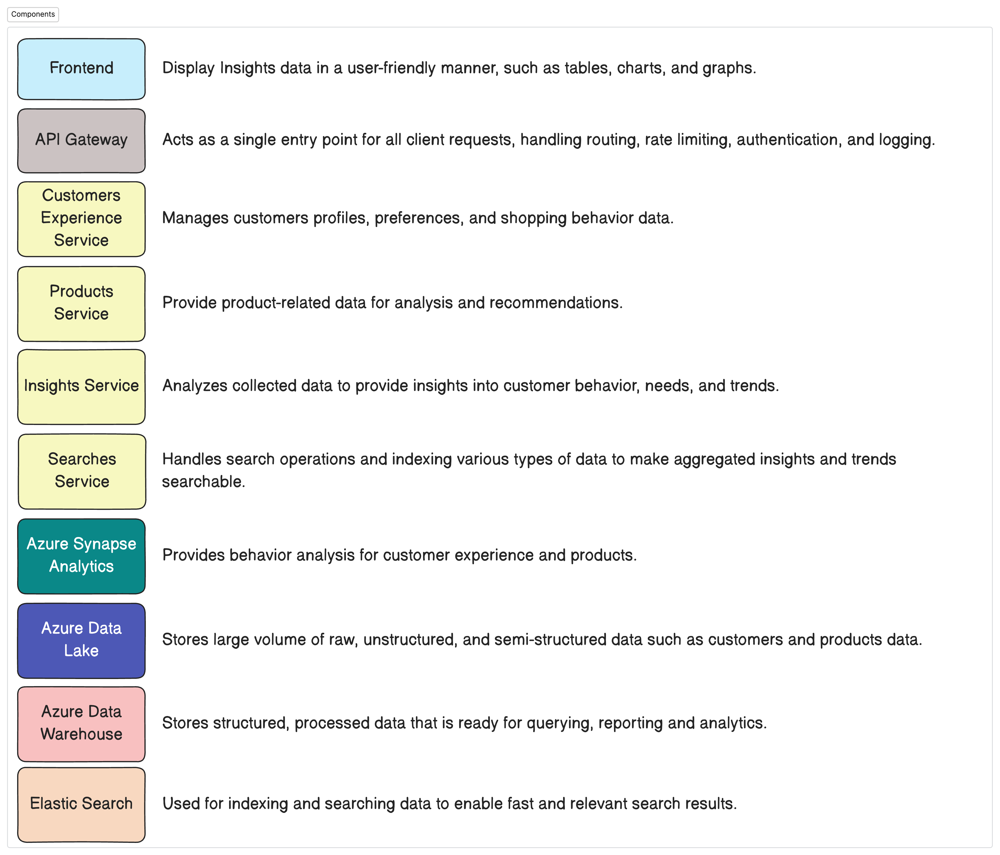

# How People Shop (HPS) Product - Technical Assignment

## Summary

The "How People Shop" (HPS) product aims to build a digital, web-based solution to collect, store, catalogue, and share insights into customer shopping experiences. This product will enable decision-makers within IKEA to understand consumer behavior, enhancing the IKEA customer experience and driving consumer-centric decision-making.

## Background

Understanding customer shopping behavior is essential for IKEA to enhance the customer experience and drive consumer-centric decision-making. This product will collect and analyze data on shopping behaviors, interactions, and engagements with home furnishing products and services, enabling IKEA to innovate and expand its omnichannel experience.

<!-- ## Problem

The primary problem addressed by this design doc is the lack of a centralized, digital solution for collecting, storing, and analyzing customer shopping experiences. The constraints include ensuring data privacy, handling large volumes of data, and providing real-time insights. Solving this problem is crucial for driving consumer-centric decision-making and enhancing the IKEA customer experience. -->
## Design

The HPS product will be implemented as a web-based solution with multiple microservices for data collection, processing, and insights generation. The architecture includes core microservices, data processing and storage solutions, and observability and security measures.

- **Architecture**
- **Component Communication flow**
- **Data Model**
- **Technologies Integration**
- **Considerations**

## Definition of Success

The proposal will be deemed successful if the following criteria are met:

- Accurate collection and storage of customer shopping data
- Efficient processing and real-time insights generation
- Secure and scalable system architecture
- Positive feedback from decision-makers within IKEA on the usability and insights provided by the product.

## Goals

- Store and catalogue existing knowledge about customer shopping experiences.
- Make the data easily searchable and accessible from within the HPS web-based product.
- Drive consumer-centric decision-making by providing insights into customer needs and behaviors.
- Strengthen the IKEA concept and ensure business growth.

## Table of Contents

1. [Architecture Diagram](#architecture-diagram)
2. [Components Communication Flow](#sequence-diagram)
3. [Unified Data Model](#unified-data-model)
4. [Technologies and Tools Integration](#technologies-and-tools-integration)
    - [Core Microservices](#core-microservices)
    - [Data Processing and Storage](#data-processing-and-storage)
    - [Observability and Data Quality](#observability-and-data-quality)
    - [Security and Authentication](#security-and-authentication)
5. [Data Flow and Integration](#data-flow-and-integration)
6. [Data Processing](#data-processing)
    - [ETL Process](#etl-process)
    - [Handling Structured and Unstructured Data](#handling-structured-and-unstructured-data)
    - [Scalability](#scalability)
    - [Trigger Mechanisms](#trigger-mechanisms)
7.  [Challenges/Concerns and Resolutions](#challengesconcerns-and-resolutions)
8.  [Coffee Consumption Calculation](#coffee-consumption-calculation)
9.  [Time Estimates for Technical Assignments](#Time-Estimates-for-Technical-Assignments)
10. [How to Run the Project](#how-to-run-the-project)
11. [Contact](#contact)

## Architecture Diagram
#### End-to-End:

#### Frontend:


## Components Communication flow



## Unified Data Model


#### Descriptions:

The HPS Data Model captures the various entities and their relationships involved in understanding customer shopping experiences. The key tables and their relationships are as follows:


| **Entity**                | **Description**                                                                                   |
|---------------------------|---------------------------------------------------------------------------------------------------|
| **Customers**             | Stores information about customers, including their name, email, and phone.                        |
| **Needs**                 | Captures different types of customer needs such as Replacement, Upgrade, or Remodel.               |
| **Product Clusters**      | Represents various product clusters like Quick Pickers, Storage Solvers, and Lasting Comfort.       |
| **Triggers**              | Includes different types of triggers that can influence shopping behavior.                         |
| **Missions**              | Defines the customer's mission types, like Solution Seeking or Recreational Shopping.              |
| **Touchpoints**           | Captures various touchpoints where customers interact with the brand.                              |
| **Journey Phases**        | Represents different phases of the customer journey.                                               |
| **Places of Purchase**    | Captures the place of purchase, either Store or Online.                                             |
| **Customer Experiences**  | Links customer interactions with various aspects of their shopping journey.                         |
| **Customer Experience Insights**      | Stores insights related to customer experiences.       
| **Product Insights**      | Stores insights related to product clusters and their triggers.                                     |
#### Sample Queries:
| Query Description                          | SQL Query                                                                                               |
|--------------------------------------------|---------------------------------------------------------------------------------------------------------|
| Retrieve Product Insights                   | ```SELECT pi.id AS insight_id, pc.name AS product_cluster, t.type AS trigger_type, pi.insight FROM product_insights pi JOIN product_clusters pc ON pi.product_cluster_id = pc.id JOIN triggers t ON pi.trigger_id = t.id;``` |
| Retrieve Customer Experiences              | ```SELECT ce.id AS experience_id, c.name AS customer_name, n.type AS need_type, m.type AS mission_type, tp.type AS touchpoint_type, jp.phase AS journey_phase, pp.type AS place_of_purchase FROM customer_experiences ce JOIN customers c ON ce.customer_id = c.id JOIN needs n ON ce.need_id = n.id JOIN missions m ON ce.mission_id = m.id JOIN touchpoints tp ON ce.touchpoint_id = tp.id JOIN journey_phases jp ON ce.journey_phase_id = jp.id JOIN places_of_purchase pp ON ce.place_of_purchase_id = pp.id;``` |
| Retrieve Customer Experience Insights      | ```SELECT cei.id AS insight_id, ce.id AS experience_id, cei.insight FROM customer_experience_insights cei JOIN customer_experiences ce ON cei.customer_experience_id = ce.id;``` |


## Technologies and Tools Integration

### Core Microservices

| **Aspect**                  | **Technologies**                                                                                 | **Specifications**                                                                                                                                      |
|-----------------------------|--------------------------------------------------------------------------------------------------|---------------------------------------------------------------------------------------------------------------------------------------------------------|
| **Customer Experience Service** | Java, Spring Boot, Azure Kubernetes Service (AKS), Azure Container Registry, Azure Active Directory (AAD) | Manages customers profiles, preferences, and shopping behavior data.                                                                                                      |
| **Products Service**        | Java, Spring Boot, Azure Kubernetes Service (AKS), Azure Container Registry, Azure Active Directory (AAD) | Provide product-related data for analysis and recommendations.                                                                                                               |
| **Insights Service**        | Java, Spring Boot, Azure Kubernetes Service (AKS), Azure Container Registry, Azure Active Directory (AAD) | Analyzes collected data to provide insights into customer behavior, needs, and trends.                                                                                                        |

### Data Processing and Storage

| **Aspect**                  | **Technologies**                                                                                 | **Specifications**                                                                                                                                      |
|-----------------------------|--------------------------------------------------------------------------------------------------|---------------------------------------------------------------------------------------------------------------------------------------------------------|
| **Data Ingestion**          | Azure Data Factory                                                                              | Pull data from various sources.                                                                                                                          |
| **Data Transformation**     | Azure Databricks                                                                                | Transform and process data within microservices.                                                                                                         |
| **Data Storage**            | Azure Synapse Analytics, Azure Data Lake Storage, Elastic Search, SQL Database (Azure SQL Database) | Store structured and unstructured data, and index for efficient retrieval.                                                                                |

### Observability and Data Quality

| **Aspect**                  | **Technologies**                                                                                 | **Specifications**                                                                                                                                      |
|-----------------------------|--------------------------------------------------------------------------------------------------|---------------------------------------------------------------------------------------------------------------------------------------------------------|
| **Monitoring**              | Prometheus, Grafana                                                                             | Real-time monitoring and visualization.                                                                                                                  |
| **Observability**           | Azure Monitor                                                                                   | Comprehensive monitoring and diagnostics.                                                                                                                |
| **Data Quality**            | Azure Data Catalog                                                                              | Maintain data quality and governance.                                                                                                                    |

### Security and Authentication

| **Aspect**                  | **Technologies**                                                                                 | **Specifications**                                                                                                                                      |
|-----------------------------|--------------------------------------------------------------------------------------------------|---------------------------------------------------------------------------------------------------------------------------------------------------------|
| **Authentication**          | Azure Active Directory (AAD)                                                                    | Authenticate users and applications.                                                                                                                     |
| **Authorization**           | Azure Active Directory (AAD)                                                                    | Implement role-based access control (RBAC).                                                                                                              |
| **Secret Management**       | Azure Key Vault                                                                                 | Store and manage secrets securely.                                                                                                                       |

## Data Flow and Integration

| **Step**                   | **Description**                                                                                   |
|----------------------------|---------------------------------------------------------------------------------------------------|
| **Data Ingestion**         | Use Azure Data Factory to pull data from various sources (databases, APIs, files). Stream real-time data through Apache Kafka to appropriate microservices. |
| **Data Transformation**    | Use Azure Databricks for transforming and processing data within microservices


## Data Processing

### ETL Process

| **Aspect**            | **Technologies**                                                                                       | **Specifications**                                                                                                                                      |
|-----------------------|--------------------------------------------------------------------------------------------------------|---------------------------------------------------------------------------------------------------------------------------------------------------------|
| **Data Extraction**   | Azure Data Factory                                                                                    | Connect to various data sources, including databases, APIs, and file systems.                                                                            |
| **Data Transformation** | Azure Databricks                                                                                     | Leverage for scalable data cleaning, normalization, and transformation.                                                                                   |
| **Data Loading**      | Azure Synapse Analytics                                                                               | Store transformed data for efficient querying and analysis.                                                                                              |

### Handling Structured and Unstructured Data

| **Aspect**            | **Technologies**                                                                                       | **Specifications**                                                                                                                                      |
|-----------------------|--------------------------------------------------------------------------------------------------------|---------------------------------------------------------------------------------------------------------------------------------------------------------|
| **Data Classification** | Azure Data Lake Storage                                                                              | Store both structured and unstructured data.                                                                                                             |
| **Processing Frameworks** | Azure Databricks                                                                                   | Process and analyze large volumes of unstructured data.                                                                                                  |
| **Indexing and Search** | Elastic Search                                                                                       | Efficient retrieval and indexing of unstructured data.                                                                                                   |

### Scalability

| **Aspect**            | **Technologies**                                                                                       | **Specifications**                                                                                                                                      |
|-----------------------|--------------------------------------------------------------------------------------------------------|---------------------------------------------------------------------------------------------------------------------------------------------------------|
| **Horizontal Scaling** | Azure Kubernetes Service (AKS)                                                                        | Scale microservices horizontally based on load.                                                                                                          |
| **Load Balancing**    | Azure Load Balancer                                                                                    | Distribute traffic across instances.                                                                                                                     |
| **Distributed Processing** | Azure Databricks                                                                                  | Use for distributed data processing and analysis.                                                                                                        |

### Trigger Mechanisms

| **Aspect**            | **Technologies**                                                                                       | **Specifications**                                                                                                                                      |
|-----------------------|--------------------------------------------------------------------------------------------------------|---------------------------------------------------------------------------------------------------------------------------------------------------------|
| **Event-Driven Architecture** | Azure Functions, Azure Event Grid                                                             | Handle various triggers using serverless functions and event grid.                                                                                       |
| **API Gateway**       | Azure API Management                                                                                   | Manage and secure APIs.                                                                                                                                  |
| **Webhook Integration** | Webhooks                                                                                             | Listen for specific events and invoke data ingestion processes.                                                                                          |

## Challenges/Concerns and Resolutions

| Concern                                                  | Resolution                                                                                                   |
|----------------------------------------------------------|--------------------------------------------------------------------------------------------------------------|
| **API Gateway Performance and Reliability**               | Implement load balancing, auto-scaling, and comprehensive monitoring. Perform regular stress testing.         |
| **Security and Access Control**                          | Use Azure Active Directory for role-based access control. Regularly audit permissions and use Azure Key Vault for sensitive information. |
| **Scalability of Back-End Services**                     | Implement horizontal scaling using Kubernetes auto-scaling features. Monitor resource allocation using Prometheus and Grafana. |
| **Observability and Monitoring**                         | Integrate Elastic Search, Prometheus, and Grafana for logging, monitoring, and visualization. Set up alerts for anomalies. |
| **Data Consistency and Integrity**                       | Use data synchronization mechanisms and Azure Synapse Analytics. Perform regular data integrity checks and backups. |
| **Deployment and CI/CD**                                 | Use Azure Pipelines for automated CI/CD processes. Implement Helm for managing Kubernetes deployments and ensure rollback mechanisms. |
| **Autoscaling Complexity**                               | Configure Kubernetes autoscaling policies carefully. Monitor the interactions between different services.       |
| **Inter-Service Communication**                          | Implement robust inter-service communication mechanisms. Consider using a service mesh like Istio for traffic management and monitoring. |

## Coffee Consumption Calculation

For simplicity, let's assume the following composition for the HPS product team:

- 1 Product Owner
- 1 Scrum Master
- 8 Development Team members

We will assume the average coffee consumption and working days per sprint for each role. Here’s the breakdown:

**Number of working days per sprint**: 10 (2-week sprint)

| Role               | Number of People | Average Cups of Coffee per Day | Total Cups of Coffee per Sprint                  |
|--------------------|------------------|-------------------------------|--------------------------------------------------|
| Product Owner      | 1                | 2                             | 1 × 2 cups/day × 10 days = 20 cups               |
| Scrum Master       | 1                | 2                             | 1 × 2 cups/day × 10 days = 20 cups               |
| Development Team   | 8                | 3                             | 8 × 3 cups/day × 10 days = 240 cups              |
| **Total**          | **10**           | -                             | **20 + 20 + 240 = 280 cups**                     |


**Conclusion**: The HPS product team consumes a total of 280 cups of coffee each sprint. <br>
***But wait... the team also needs some champagne! 🍾🎉 For celebrating team collaboration and successful deliveries!***

## Time Estimates for Technical Assignments

| Assignment Task                                 | Time Estimate   |
|-------------------------------------------------|-----------------|
| Solo brainstorming with my pen and notebook     | 1-2 hours       |
| Sketching Architecture Diagrams                 | 4-5 hours       |
| Creating customer experience Restful APIs       | 2-3 hours       |
| HPS Unified Data Model + SQL Queries            | 1-2 hours       |
| Technical Specification                         | 1-2 hours       |
| Challenges/Concerns + Calculation of cups of coffee | 1-2 hours    |
| Thinking & Apply improvements                   | 1-2 hours       |
| Document everything in README.md file           | 1-2 hours       |

**Total Estimated Time:** 12-20 hours

## How to Run the Project

### Prerequisites

- Java JDK 17+
- Docker
- Maven

### Steps


## How to Run

1. Clone the repository:
    ```bash
    git clone https://github.com/r0jjames/IKEA-How-People-Shop-Project.git
    cd customers-experience
    ```
2. Run DB in the Docker container:
    ```bash
    cd docker-compose
    docker compose up
    ```
3. Build the project:
    ```bash
    ./mvnw clean install
    ```

4. Run the application:
    ```bash
    ./mvnw spring-boot:run
    ```
5. The application uses OpenAPI for API documentation and Testing of APIs. Once the application is running, you can access the documentation UI at: http://localhost:8080/swagger-ui.html

## API Endpoints

### Product Insights

Retrieve insights on how people shop for different product clusters.

- **URL:** `/api/products/insights`
- **Method:** `GET`
- **Description:** Fetches all product insights.

#### Sample Response:

```json
[
    {
        "id": 1,
        "productClusterId": 1,
        "triggerId": 1,
        "insight": "Quick Pickers are highly influenced by price reductions during sales events."
    },
    {
        "id": 2,
        "productClusterId": 2,
        "triggerId": 2,
        "insight": "Storage Solvers see an increase in demand during the back-to-school season."
    }
    
]
```
### Customer Insights
Retrieve insights on customer experiences.
- **URL:** `/api/customers/insights`
- **Method:** `GET`
- **Description:** Fetches all customer experience insights.

#### Sample Response:

```json
[
    {
        "customerExperienceId": 1,
        "title": "Seamless Browsing Experience",
        "description": "Customer found the online browsing experience seamless and intuitive."
    },
    {
        "customerExperienceId": 2,
        "title": "Overwhelmed by Options",
        "description": "Customer felt overwhelmed by too many options at the store."
    },
    {
        "customerExperienceId": 3,
        "title": "Easy Product Comparison",
        "description": "Comparing products on the brand website was easy and helpful."
    }
    
]
```

### Customer Experiences
Retrieve details on customer experiences.
- **URL:** `/api/customers/experiences`
- **Method:** `GET`
- **Description:** Fetches all customer experiences.

#### Sample Response:

```json
[
  {
    "id": 1,
    "customerId": 1,
    "customerName": "Alice Johnson",
    "needType": "Replacement",
    "missionType": "Solution Seeking",
    "touchpointType": "Brand Website",
    "journeyPhase": "Browsing",
    "placeOfPurchase": "Store"
  },
  {
    "id": 2,
    "customerId": 2,
    "customerName": "Bob Brown",
    "needType": "Upgrade",
    "missionType": "Recreational Shopping",
    "touchpointType": "Store",
    "journeyPhase": "Filtering",
    "placeOfPurchase": "Online"
  },
    
]
```

# Contact
For any inquiries or issues, please email: rojjamescarranza@gmail.com.